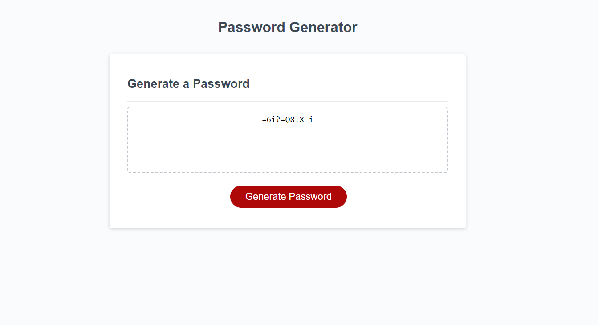

# Password-Generator-project
    
   
   [ - Description](#description)
 
   [ - Installation](#installation)
 
   [ - Usage](#usage)
   
   [ - Contributing](#contributing)
   
   [ - Tests](#tests)
   
   [ - Questions](#questions)
  
   [ - License](#license)

 
   ## Description
  As a user, I want the ability to generate strong passwords with random characters to protect my online accounts. Using Javascript, the site prompts the user if they want lowercase letters, uppercase letters, numbers, and special characters. The user also has to specify the desired length. The password is then generated and ouput in a text field ready for use.

  Link:
  [Password-Generator](https://sarahhn92.github.io/Password-Generator-project/)

  Screenshot:
  
  
  
  ## Installation
 N/m
 

  ## Usage
 To generate secure passwords.
 
  
  ## Contributing
  N/a
 
  
  ## Tests
  n/a
  

  ## Questions
  Feel free to contact me via email, smcfarland2@gmail.com if you have any questions regarding this project. 
  Additionally, my GitHub profile is [SarahHn92](https://github.com/SarahHn92) to view more projects.

  ## License
  There is no licensing information for this project.
